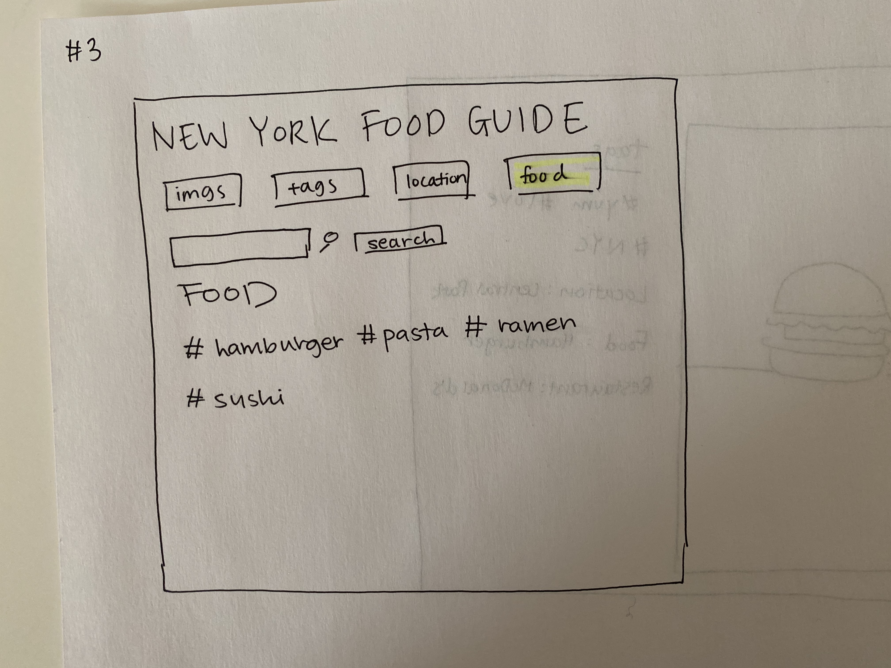

# Project 3: Design Journey

Be clear and concise in your writing. Bullets points are encouraged.

**Everything, including images, must be visible in VS Code's Markdown Preview.** If it's not visible in Markdown Preview, then we won't grade it.

# Design & Plan (Milestone 1)

## Describe your Gallery (Milestone 1)
> What will your gallery be about? 1 sentence.

My gallery will be a gallery for food images based on restaurants in New York City.

> Will you be using your existing Project 1 or Project 2 site for this project? If yes, which project?

No.

> If using your existing Project 1 or Project 2, please upload sketches of your final design here.


## Target Audience(s) (Milestone 1)
> Tell us about your target audience(s).

My target audience will be foodies looking to explore new dishes/restaurants you can find in New York City.

## Design Process (Milestone 1)
> Document your design process. Show us the evolution of your design from your first idea (sketch) to design you wish to implement (sketch). Show us the process you used to organize content and plan the navigation (card sorting), if applicable.
> Label all images. All labels must be visible in VS Code's Markdown Preview.
> Clearly label the final design.


My very first sketch. However, I wanted to have tabs where you could see just tags and just images, so I redirected my sketch to include those features.





This was my first sketch. However, I found that having a food tag was a bit redunant, so I just altered my sketch to include just a images, tags, and location nav bar. This also fits the needs of my users because this website acts as a guide for them to look for new restaurants, and location filtering will allow them to find the places that have the food much quicker.


After my milestone 1, I made minor changes to my design, mostly to my home page. First, I decided to get rid of the search bar to make the visual of the website more clean to look at. I felt that having the search bar made my website look too much like a catalog/database, so I decided to have the user navigate the page through the navigation tabs, which were pretty easy to use. Furthermore, on my home page, I decided to have my tags display on the bottom of my images instead of next to them, because it looked alot neater that way. I also decided to have a form on the bottom for easy access.


## Design Patterns (Milestone 1)
> Explain how your site leverages existing design patterns for image galleries.
> Identify the parts of your design that leverage existing design patterns and justify their usage.
> Most of your site should leverage existing patterns. If not, fully explain why your design is a special case (you need to have a very good reason here to receive full credit).

- The layout of the gallery mimics the vsco layout of having all the images laid out in a grid. However, unlike vsco, I decided to display the tags alongside the image for convenience. There is also an add image button at the bottom right corner.

- The layout of the individual image looks like Instagram where the image is on the left hand side and the tags are listed (instead of comments like Instagram) on the right hand side. There is also the delete functionality on the lower right that is not on Instagram but this is for user convenience to have the button right there.

- For accesing the options of add image, delete image, and existing images, I implemented a 3 dot menu found in VSCO.


## Requests (Milestone 1)
> Identify and plan each request you will support in your design.
> List each request that you will need (e.g. view image details, view gallery, etc.)
> For each request, specify the request type (GET or POST), how you will initiate the request: (form or query string param URL), and the HTTP parameters necessary for the request.

Example:
- Request: view movie details
  - Type: GET
  - Params: id _or_ movie_id (movies.id in DB)

- Request: view image details
    - Type: GET
    - Params: image_id

- Request: add image
    - TYPE: POST
    - Params: image_id, tags, location

- Request: delete image
    - TYPE: POST
    - Params: image_id

- Request: search tags
    - Type: GET
    - Params: tag_id, image_id, tags, location, file_name, file_exit


## Database Schema Design (Milestone 1)
> Plan the structure of your database. You may use words or a picture.
> Make sure you include constraints for each field.

> Hint: You probably need `images`, `tags`, and `image_tags` tables.

> Hint: For foreign keys, use the singular name of the table + _id. For example: `image_id` and `tag_id` for the `image_tags` table.


Example:
```
movies (
id : INTEGER {PK, U, Not, AI}
field2 : ...
...
)
```

images(
    id: INTEGER {PK, U, Not, AI}
    file_name: TEXT {Not}
    file_ext: TEXT {Not}
    citation: TEXT {Not}
    description: TEXT {Not}
)

tags(
    id: INTEGER {PK, U, Not, AI}
    image_id: id: INTEGER {Not}
    tag: TEXT {Not}
)

location_tags(
    id: INTEGER {PK, U, Not, AI}
    image_id: INTEGER INTEGER {Not}
    location: TEXT {Not}
)

all_tags{
    id: INTEGER {PK, U, Not, AI}
    image_id: INTEGER {Not}
    location_id: INTEGER
    tag_id: INTEGER {Not}
}


## Database Query Plan (Milestone 1)
> Plan your database queries. You may use natural language, pseudocode, or SQL.
> Using your request plan above, plan all of the queries you need.

Getting images from search:

SELECT images.file_name, images.file_exit FROM images INNER JOIN tags ON tags.id = images.id WHERE tag = 'search term';

Getting images from a certain location:

SELECT images.file_name, images.file_exit FROM images INNER JOIN location_tags ON images.id = location_tags.id WHERE location = 'search';

Getting image details:

SELECT images.description FROM images INNER JOIN tags ON tags.id = images.id


## Code Planning (Milestone 1)
> Plan what top level PHP pages you'll need.

index.php
    - for the home page
tags.php
    - list of all tags
location.php
    - page to display all the location tags

> Plan what partials you'll need.

head: includes DOC information and stylesheet
header:
    -includes header(Title) and "nav bar" for the filters and search bar

> Plan any PHP code you'll need.

Example:
```
Put all code in between the sets of backticks: ``` code here ```

foreach ($records as $record) {
    echo "<li>";

if user searches tag:
    execute query (SELECT images.file_name, images.file_exit FROM images INNER JOIN tags ON tags.id = images.id WHERE tag = 'search term');

if user uploads image:
    INSERT INTO images (id, tag_id, location_id, file_name, file_ext, citation, description)

if user searches:
    execute SQL query for search

```

# Complete & Polished Website (Final Submission)

## Gallery Step-by-Step Instructions (Final Submission)
> Write step-by-step instructions for the graders.
> For each set of instructions, assume the grader is starting from index.php.

Viewing all images in your gallery:
1. Go to index.php

View all images for a tag:
1. Go to tags tab  (tags.php)
2. Click on tag you want to see all the images for

View a single image and all the tags for that image:
1. Go to index.php, the home page, and click on any image

How to upload a new image:
1. Go to bottom of index.php and fill out form to upload a new image

How to delete an image:
1. Go to the page to see a single image
2. Click the delete button labelled "delete"

How to view all tags at once:
1. Go to tags tab at the nav bar(tags.php)

How to add a tag to an existing image:
1. Click on an image from index.php
2. Click on the three dots
3. Choose whether you would like to add an existing tag or a new tag
4. Click save changes

How to remove a tag from an existing image:
1. Click on an image from index.php
2. Click on the three dots
3. Click Delete tag
4. Choose tag to delete and click save changes


## Reflection (Final Submission)
> Take this time to reflect on what you learned during this assignment. How have you improved since starting this class?

Through this project, I was able to grow as a coder and learn outside the classroom. There were many instances in which I had to look up reference documentation to complete tasks, such as unlinking the path for an image. Furthermore, I became much more comfortable with php, comapred to the beginning of the class when I did not know the language at all. I think that my planning skills and thought process as a coder also developed since the beginning of the class, and now I think much more methodically about potential bugs and solutions to my code.
